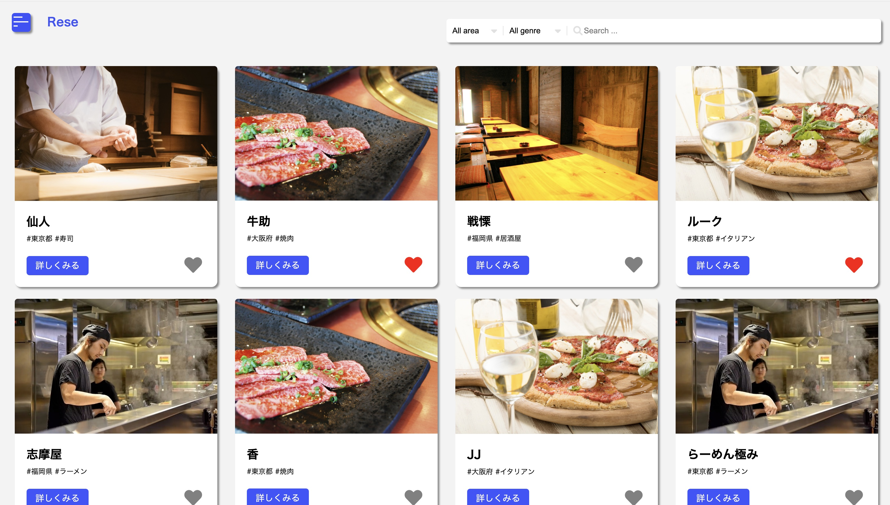

# Rese（リーズ）
飲食店の予約サイトのアプリです。

## 上級模擬案件
## 機能一覧
- 会員登録機能
- ログイン機能
- いいね機能
- 店舗検索機能
- 店舗予約機能
## 使用技術
- PHP 7.4.9
- Laravel 8.83.27
- MySQL 8.0.26
## テーブル設計


## ER図

# 環境構築
**Dockerビルド**
1. 以下のコマンドを入力しクローンを作成する。
``` bash
    git clone git@github.com:hiro8787/advance-laravel.git
```
2. 以下のコマンドでリポジトリの移動を実行する。
``` bash
    cd advance-laravel
```
3. docker composeを使ってコンテナ構築をする。
``` bash
    docker-compose up -d --build
```

> *`no matching manifest for linux/arm64/v8 in the manifest list entries`とエラーメッセージが出る場合
docker-compose.ymlファイルの「mysql」と「phpmyadmin」内に「platform」の項目を追加で記載してください*
``` bash
mysql:
    platform: linux/x86_64(この文を追加)
    image: mysql:8.0.26
    environment:
```
``` bash
phpmyadmin:
    platform: linux/x86_64(この文を追加)
    image: phpmyadmin/phpmyadmin
    environment:
```
**Laravel環境構築**
1. 以下のコマンドでPHPのコンテナにアクセスする。
``` bash
    docker-compose exec php bash
```
2. 以下のコマンドで「.env.example」ファイルを元に「.env」を作成する。
``` bash
    cp .env.example .env
```
3. .envに以下の環境変数を追加
``` text
    DB_CONNECTION=mysql
    DB_HOST=mysql
    DB_PORT=3306
    DB_DATABASE=laravel_db
    DB_USERNAME=laravel_user
    DB_PASSWORD=laravel_pass
```
4. 以下のコマンドでcomposerをインストールする。
``` bash
    composer install
```
5. アプリケーションキーの作成をする
``` bash
php artisan key:generate
```
6. マイグレーションの実行
``` bash
php artisan migrate
```
7. シーディングの実行
``` bash
php artisan db:seed
```
**MailHogの環境構築手順**(電子メールのテストツールです)
1. .envファイルに下記を追加
``` text
    MAIL_MAILER=smtp
    MAIL_HOST=mailhog
    MAIL_PORT=1025
    MAIL_USERNAME=null
    MAIL_PASSWORD=null
    MAIL_ENCRYPTION=null
    MAIL_FROM_ADDRESS=hello@example.com (このアドレスを追記)
    MAIL_FROM_NAME="${APP_NAME}"
```
2. メールの確認画面
`http://localhost:8025` にアスセスする事で確認可能

**管理画面で店舗追加時の必須項目** ※下記に見本あり
1. `store_name(店名)`
2. `image(お店のイメージ画像) ※画像URL`
3. `location(都道府県)`
4. `category(お店の種類)`
5. `explanation(お店の紹介文)`

**アカウントの種類**
1. 一般ユーザー
一般ユーザーは会員登録後にお店の予約や、お気に入り登録、レビュー等して頂けます。
※会員登録にはメール認証が必須となります。
2. 店舗代表者ユーザー
店舗代表者ユーザーは以下のアドレスでログインして頂くと、店舗情報の作成や更新、予約情報の確認が可能です。  
メールアドレス：`representative@example.com`  
パスワード：`password`
3. 管理ユーザー
管理ユーザーは以下のアドレスでログインして頂くと、お店の追加や店舗代表者を作成できます。  
メールアドレス：`admin@example.com`  
パスワード：`password`

## 環境開発
- http://localhost/
- phpMyAdmin：http://localhost:8080/